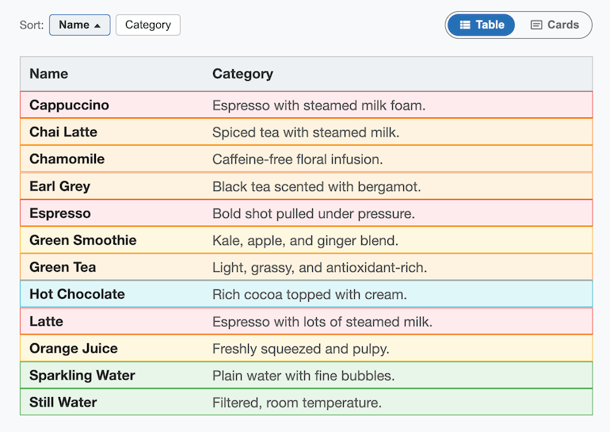
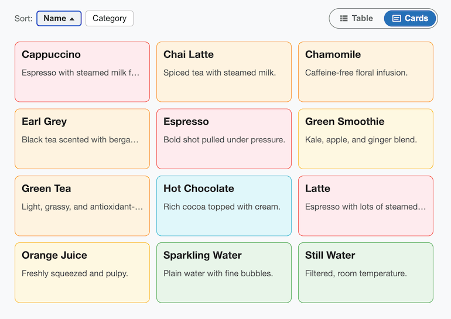

# React-Morph-Table-Cards

A reusable React component that displays a list of items as a **table** or as
**cards**, with animated transitions between the two layouts, on sorting, and
on window resize.

Check out the [Demo](https://evoluteur.github.io/react-morph-table-cards).





It's a React port of [isomorphic-table-cards](https://github.com/evoluteur/isomorphic-table-cards),
a vanilla-JS/CSS project that achieves the morphing effect with absolutely
positioned items and CSS transitions on `transform` which was a port of [d3-table-cards](https://github.com/evoluteur/d3-table-cards).

## Install

```bash
npm install react-morph-table-cards
```

## Usage

```jsx
import { MorphTableCards } from "react-morph-table-cards";
import "react-morph-table-cards/style.css";

const data = [
  { id: 1, name: "Espresso", description: "Bold shot pulled under pressure.", category: "Coffee" },
  { id: 2, name: "Green Tea", description: "Light, grassy, and antioxidant-rich.", category: "Tea" },
  // ...
];

function App() {
  return (
    <MorphTableCards
      data={data}
      onItemClick={(item) => console.log("clicked", item)}
    />
  );
}
```

The component renders its own toolbar (Sort by Name/Category, a Table/Cards
view toggle, and a light/dark/omg theme toggle) above the list, so it works
as a drop-in, self-contained widget.

## Props

| Prop          | Type                                  | Required | Description                                                                 |
| ------------- | -------------------------------------- | -------- | ----------------------------------------------------------------------------- |
| `data`        | `Array<{ id?, name, description, category }>` | yes      | Items to display. `id` is optional; when omitted, `name` is used as the item's identity, so `name` should be unique. |
| `disabled`    | `boolean`                              | no       | When `true`, dims the component and disables sorting, view toggling, and `onItemClick`. Defaults to `false`. |
| `className`   | `string`                               | no       | Extra class name(s) applied to the root element. |
| `onItemClick` | `(item, event) => void`                | no       | Called when an item (card or row) is clicked or activated via keyboard. |

### Additional (optional) props

These have sensible defaults and don't need to be set for typical use:

| Prop          | Type                | Default    | Description                          |
| ------------- | ------------------- | ---------- | ------------------------------------- |
| `defaultView` | `"cards" \| "table"` | `"cards"`  | Initial view.                         |
| `cardWidth`   | `number`             | `210`      | Card width in pixels (also used as the "Name" column width in table view). |
| `cardHeight`  | `number`             | `94`       | Card height in pixels.                |
| `cardGap`     | `number`             | `10`       | Gap between cards, in pixels (cards view only). |
| `rowHeight`   | `number`             | `31`       | Row height in pixels (table view).    |
| `theme`            | `"light" \| "dark" \| "omg"`        | —          | Controls the theme externally. Omit to let the component manage its own theme state (uncontrolled). |
| `defaultTheme`     | `"light" \| "dark" \| "omg"`        | system preference | Initial theme when uncontrolled and nothing is in `localStorage` yet. |
| `onThemeChange`    | `(theme) => void`                    | —          | Called whenever the theme changes (controlled or uncontrolled). |
| `themeStorageKey`  | `string`                             | —          | When set, the chosen theme is persisted to `localStorage` under this key and restored on mount. Off by default so the component doesn't write to storage unasked. |
| `showThemeToggle`  | `boolean`                            | `true`     | Set to `false` to hide the built-in theme toggle (e.g. if the host page drives `theme` itself). |

## Theming

The component ships with three themes — **light**, **dark**, and **omg**
(the blue theme from [evoluteur.github.io](https://evoluteur.github.io/))
— toggled with the same three-icon control (sun / moon / spiral) used on
[evoluteur-blog](https://github.com/evoluteur/evoluteur-blog), rendered at
the top right of the toolbar.

Theming is scoped to the component via a `data-theme` attribute on the root
`.rmtc` element — it never touches `document.documentElement` — so it's
safe to drop into a page that has its own theming system. Colors are driven
by CSS custom properties (`--rmtc-bg`, `--rmtc-panel-bg`, `--rmtc-text`,
`--rmtc-text-secondary`, `--rmtc-border`, `--rmtc-primary`,
`--rmtc-toggle-bg`), overridable per theme via `.rmtc[data-theme="..."]` if
you want to restyle or add a theme.

## Styling

Items are color-coded by `category`, cycling through a 7-color default
palette (`.rmtc-category-1` through `.rmtc-category-7`, unaffected by
theme since they're always light pastel chips) defined in `style.css`.
Override these classes, or the CSS custom properties `--rmtc-card-width`,
`--rmtc-card-height`, and `--rmtc-row-height` on the root `.rmtc` element,
to customize appearance.

## Local development

```bash
npm install
npm run dev      # runs the demo app in ./demo
npm run build    # builds the library to ./dist
```

## License

react-morph-table-cards is released under the MIT license.

Encourage this project by becoming a [sponsor](https://github.com/sponsors/evoluteur).

You may want to also check out [React-Morph-Charts](https://github.com/evoluteur/react-morph-charts), a similar project for animated transitions between bubble, bars, and pie charts.

(c) 2026 [Olivier Giulieri](https://evoluteur.github.io/).
